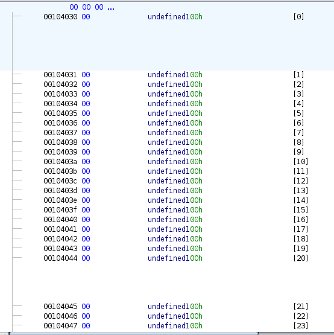

## 1. Informazioni Generali
* **Piattaforma:** [olicyber.training.it]
* **Sezione:** [Software Security]
* **Difficoltà:** [Media]
* **Sfida:** `nc gtn.challs.olicyber.it 10022`
## 2. Allegati
In allegato alla sfida viene fornito l'eseguibile del programma C che gira sul server
## 3. Analisi delle vulnerabilità
Il programma parte chiedendo di mettere il tuo nome, poi lascia all'utente 5 tentativi per indovinare un numero calcolato **random**. Analizzando l'eseguibile, dato in allegato dalla challenge, troviamo varie funzioni. Analizziamo la funzione **_gamePlay_**:
```C
undefined8 gamePlay(void)
{
  undefined8 uVar1;
  long in_FS_OFFSET;
  int guess;
  char *local_28;
  size_t local_20;
  FILE *local_18;
  long local_10;
  
  local_10 = *(long *)(in_FS_OFFSET + 0x28);
  puts("What number am I thinking about? Try to guess it!");
  do {
    if ((int)gamedata._20_4_ < 1) {
      puts("No luck! :(");
      printf("The number was %d\n",(ulong)(uint)gamedata._24_4_);
      puts("Try again, eventually you will succed!");
      uVar1 = 0;
LAB_001014d4:
      if (local_10 != *(long *)(in_FS_OFFSET + 0x28)) {
                    /* WARNING: Subroutine does not return */
        __stack_chk_fail();
      }
      return uVar1;
    }
    gamedata._20_4_ = gamedata._20_4_ + -1;
    __isoc99_scanf(&DAT_001020a2,&guess);
    if (gamedata._24_4_ == guess) {
      printf("Well done %s! You earned a place in the high-scores and a little treat!\n",gamedata);
      local_18 = fopen("flag","r");
      local_28 = (char *)0x0;
      local_20 = 0;
      getline(&local_28,&local_20,local_18);
      fclose(local_18);
      printf("Your treat: %s",local_28);
      free(local_28);
      uVar1 = 1;
      goto LAB_001014d4;
    }
    if ((int)gamedata._24_4_ < guess) {
      puts("Try lower ;)");
    }
    else {
      puts("Try higher ;)");
    }
  } while( true );
}
```
Vediamo che il numero da indovinare è memorizzata in **_gamedata._20_4_**. Se andiamo a vedere, tramite **Ghidra**, la parte di memoria dove è salvata questa variabile **globale**, notiamo che porta alla cella 20 della variabile **_gamedata_**. 



Andiamo ora ad analizzare la funzione **_gameWelcome_**:
```C
void gameWelcome(void)
{
  puts("Welcome to GuessTheNumber!");
  puts("Please enter your name so that you can be added to the high scores:");
  gets(gamedata);
  return;
}
```
Possiamo notare che viene utilizzata la funzione **_gets_**, che rende il codice vulnerabile a **Buffer Overflow**. Vedendo, come da foto sopra, il modo in cui è salvata la variabile **_gamedata_**, è possibile sovrascrivere il numero randomico generato dal codice con uno che inseriamo noi.
## 4. Exploitation
Nel momento in cui ci viene chiesto il nome inseriamo una stringa lunga 28 caratteri: gli ultimi 4 caratteri (**N.B.** vengono salvati in memoria come codice **ASCII** in esadecimale, utilizzando il **LIttle Endian**), andranno a sovrascrivere **_gamedata_** nelle celle dalla 24 alla 28,  e rappresenteranno il numero da indovinare. Per ottenere il corrispettivo valore intero bisogna prendere quei 4 caratteri, trasformarli in codice **ASCII**, invertirli rispettando il **Little Endian** e convertire in intero.
Un esempio di nome da inserire è il seguente:
```
aaaaaaaaaaaaaaaaaaaaaaaa0000
```
Sono 21 **_'a'_** seguite da 4 zeri. Facendo i contri sopra si trova che il numero da indovinare per questo input è
```
808464432
```
La flag che si ottiene alla fine è la seguente:
```
flag{4lw4y5_r34d_w4rn1ng5_>:[}
```