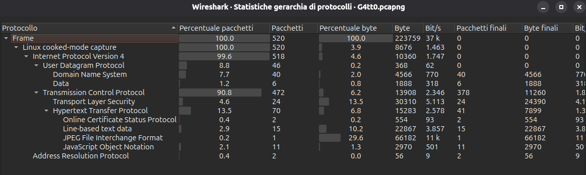

## 1. Informazioni Generali
* **Piattaforma:** [olicyber.training.it]
* **Sezione:** [Network]
* **Difficoltà:** [Facile] 

## 2. Analisi delle vulnerabilità
Analizziamo il traffico di rete del file `.pcapng` fornito dalla sfida. 

Possiamo notare che c'è una riga denominata `JPEG File Interchange Format` che, in percentuale byte, occupa il 29,6%, nonostante sia un singolo pacchetto. Significa che è stata scaricata un'immagine in chiaro.
## 3. Exploitation
Sapendo che è stata scaricata un'immagine basta andare a scaricarla. Per fare ciò basta andare su `File > Esporta Oggetti > HTTP`, e lì troveremo il file `Gatto.jpeg`, che basterà scaricare. 
Aprendo l'immagine troviamo la flag:
```
flag{C4ts4r3Cut3}
```
